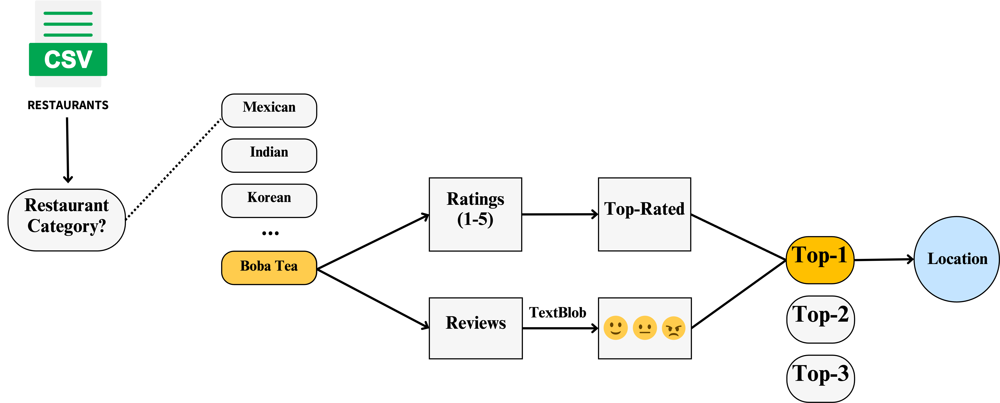
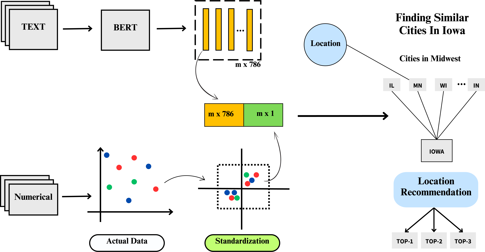

# Iowa Business Location Recommendation System

This project was developed for the PI515 Iowa AI Challenge to tackle key challenges in Iowa's entrepreneurial ecosystem through innovative AI solutions.

## Objective

The project aims to increase the number of restaurant options in Iowa by analyzing Midwest city demographics and recommending opening a restaurant in Iowa similar to successful ones in other Midwest cities.

## Motivation

The motivation comes from the lack of food options available in Iowa. By increasing the diversity of food options and fostering entrepreneurial spirit in Iowa, the project aims to provide top recommendations to potential restaurateurs based on successful Midwest city restaurants, encouraging entrepreneurship and business growth in Iowa.

## Data Sources

Yelp restaurant reviews and ratings
US Census demographics data
We are also sharing the cleaned and compiled data for public use.

## Recommendation System

The system receives input from users about the restaurant category they want to open in Iowa. It then identifies the top 3 successful restaurants in that category in the Midwest, determines their locations, and recommends a city in Iowa that is similar to the successful city in the Midwest. This indicates that a restaurant successful in a similar city in the Midwest has a good chance of success in the recommended Iowa city.

